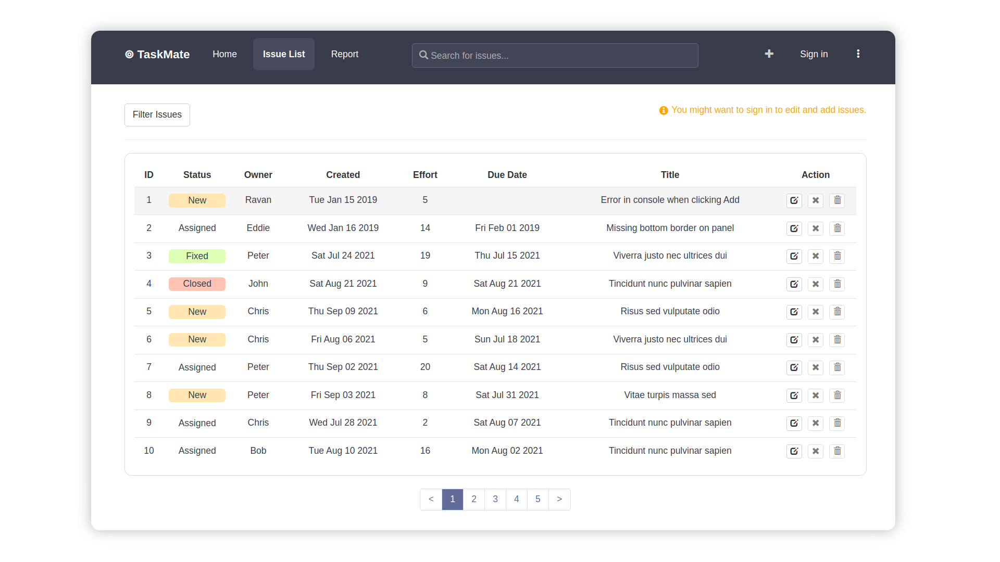
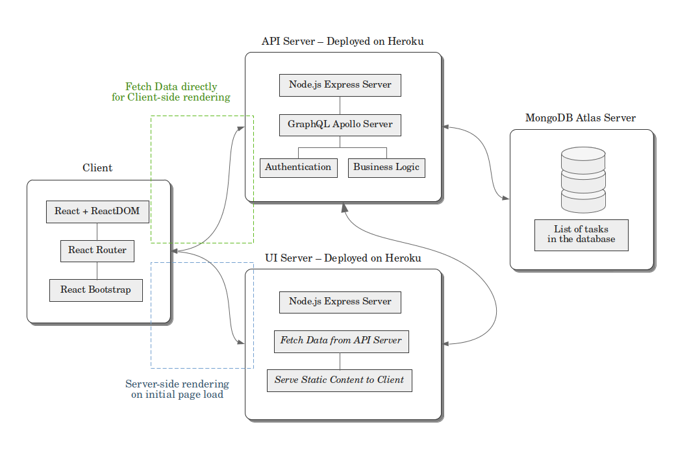

# TaskMate 📝
A simple project planning app for developers where creating issues, assigning tasks among team members and tracking the progress becomes swift and easy.
<br/>



## Features
The users will be able to:<br/>
- **Create** a new task with initial values comprising title, owner, due date and description.<br/>
- **Update** and modify the field values of each task. <br/>
- **Delete** issues which are deemed finished or fixed.
- **Filter** the view of the list of tasks by different parameters.
- **Summarize** the overall status of the tasks with respect to each owner.
<br/>

**Authentication** is enabled, and only the **authorized** users can perform any addition or modification operations on the tasks. Unauthorized users can still view the data. 
## Architecture


## Quick Start

Install MongoDB server along with mongo shell on your system - [Docs](https://docs.mongodb.com/v4.4/installation/). 

<br/>

Clone this repo:
```bash
git clone https://github.com/aungmcs/issue-tracker

# get into project folder
cd issue-tracker
```
Start the mongodb local server:
```bash
# initialize the primary daemon process for the MongoDB server
sudo systemctl start mongod
```
Initialize the API server:
```bash
# get into the api folder
cd api

# prefill data in the local MongoDB server through mongo shell
mongo mongodb://localhost/issuetracker /scripts/init.mongo.js

# install dependencies
npm install

# add environment variables in .env file
echo "DB_URL=mongodb://localhost/issuetracker
API_SERVER_PORT=3000
UI_SERVER_ORIGIN=http://localhost:8000
COOKIE_DOMAIN=localhost
ENABLE_CORS=true
NODE_ENV=development
JWT_SECRET=#any-key-of-your-choice" >> .env

# start the api server
npm start
```
Initialize the UI server:
```bash
# get into the ui folder
cd ui

# add environment variable in .env file
echo "UI_SERVER_PORT=8000
UI_API_ENDPOINT=http://localhost:3000/graphql
UI_AUTH_ENDPOINT=http://localhost:3000/auth
NODE_ENV=development
ENABLE_HMR=false" >> .env 

# install dependencies
npm install

# start the development server
npm run dev
```
## Attribution
This work was developed during my learning process of MERN stack with the help of the book: [**Pro MERN Stack: Full Stack Web App Development by Vasan Subramanian**](https://g.co/kgs/LcjBT7).


